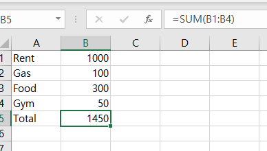

# Tutorial 1: Create a simple XLSX file
```python
expenses = (
    ['Rent', 1000],
    ['Gas',   100],
    ['Food',  300],
    ['Gym',    50],
)
```

```python
import xlsxwriter

# Create a workbook and add a worksheet.
workbook = xlsxwriter.Workbook('Expenses01.xlsx')
worksheet = workbook.add_worksheet()

# Some data we want to write to the worksheet.
expenses = (
    ['Rent', 1000],
    ['Gas',   100],
    ['Food',  300],
    ['Gym',    50],
)

# Start from the first cell. Rows and columns are zero indexed.
row = 0
col = 0

# Iterate over the data and write it out row by row.
for item, cost in (expenses):
    worksheet.write(row, col,     item)
    worksheet.write(row, col + 1, cost)
    row += 1

# Write a total using a formula.
worksheet.write(row, 0, 'Total')
worksheet.write(row, 1, '=SUM(B1:B4)')

workbook.close()
```
