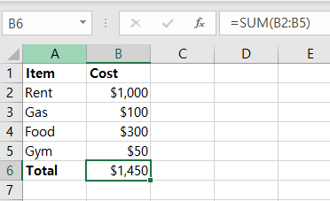

# Tutorial 2: Adding formatting to the XLSX File
```python
 import xlsxwriter

 # Create a workbook and add a worksheet.
 workbook = xlsxwriter.Workbook('Expenses02.xlsx')
 worksheet = workbook.add_worksheet()

 # Add a bold format to use to highlight cells.
 bold = workbook.add_format({'bold': True})

 # Add a number format for cells with money.
 money = workbook.add_format({'num_format': '$#,##0'})

 # Write some data headers.
 worksheet.write('A1', 'Item', bold)
 worksheet.write('B1', 'Cost', bold)

 # Some data we want to write to the worksheet.
 expenses = (
     ['Rent', 1000],
     ['Gas',   100],
     ['Food',  300],
     ['Gym',    50],
 )

 # Start from the first cell below the headers.
 row = 1
 col = 0

 # Iterate over the data and write it out row by row.
 for item, cost in (expenses):
     worksheet.write(row, col,     item)
     worksheet.write(row, col + 1, cost, money)
     row += 1

 # Write a total using a formula.
 worksheet.write(row, 0, 'Total',       bold)
 worksheet.write(row, 1, '=SUM(B2:B5)', money)

 workbook.close()
```

