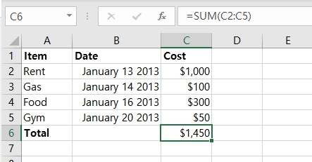

# Tutorial 3: Writing different types of data to the XLSX File

```python
 from datetime import datetime
 import xlsxwriter

 # Create a workbook and add a worksheet.
 workbook = xlsxwriter.Workbook('Expenses03.xlsx')
 worksheet = workbook.add_worksheet()

 # Add a bold format to use to highlight cells.
 bold = workbook.add_format({'bold': 1})

 # Add a number format for cells with money.
 money_format = workbook.add_format({'num_format': '$#,##0'})

 # Add an Excel date format.
 date_format = workbook.add_format({'num_format': 'mmmm d yyyy'})

 # Adjust the column width.
 worksheet.set_column(1, 1, 15)

 # Write some data headers.
 worksheet.write('A1', 'Item', bold)
 worksheet.write('B1', 'Date', bold)
 worksheet.write('C1', 'Cost', bold)

 # Some data we want to write to the worksheet.
 expenses = (
     ['Rent', '2013-01-13', 1000],
     ['Gas',  '2013-01-14',  100],
     ['Food', '2013-01-16',  300],
     ['Gym',  '2013-01-20',   50],
 )

 # Start from the first cell below the headers.
 row = 1
 col = 0

 for item, date_str, cost in (expenses):
     # Convert the date string into a datetime object.
     date = datetime.strptime(date_str, "%Y-%m-%d")

     worksheet.write_string  (row, col,     item              )
     worksheet.write_datetime(row, col + 1, date, date_format )
     worksheet.write_number  (row, col + 2, cost, money_format)
     row += 1

 # Write a total using a formula.
 worksheet.write(row, 0, 'Total', bold)
 worksheet.write(row, 2, '=SUM(C2:C5)', money_format)

 workbook.close()
```

