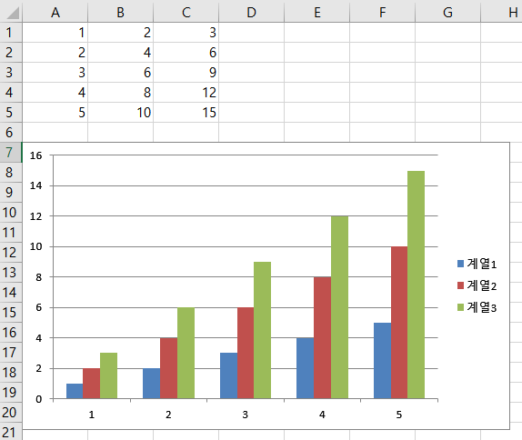
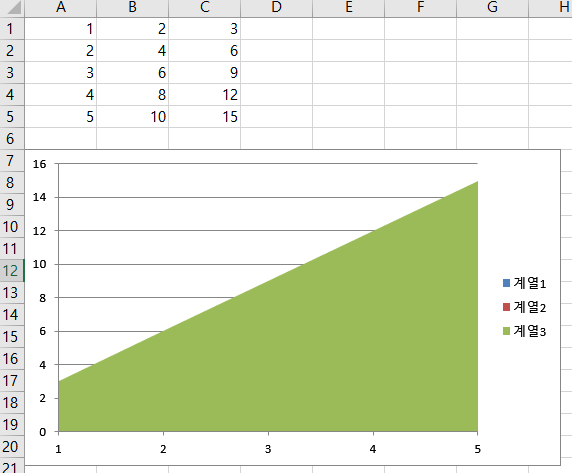
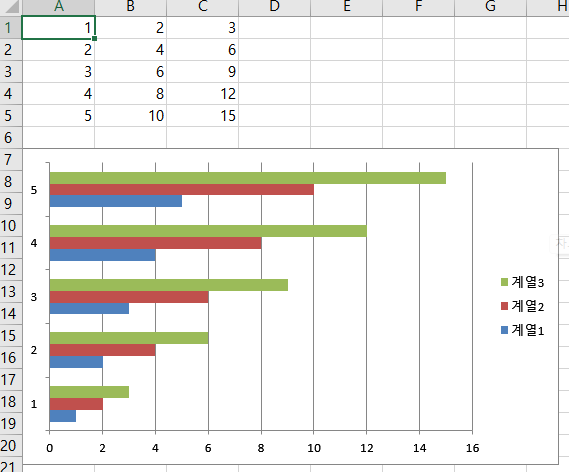
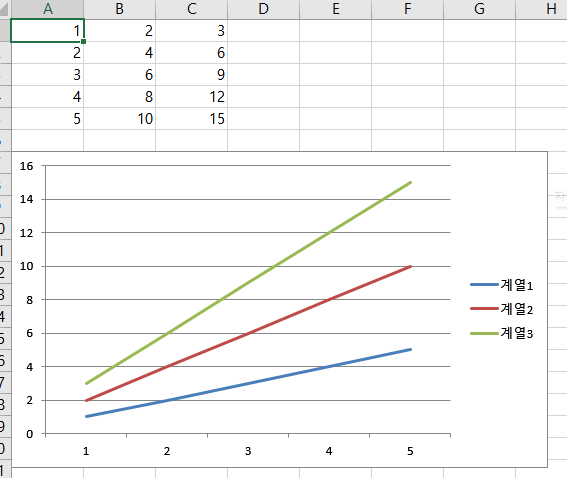
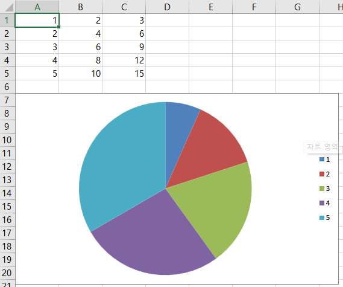
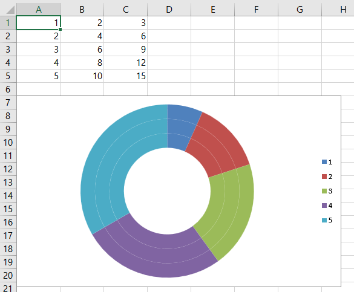
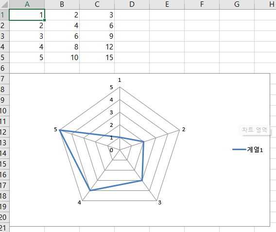

# XlsxWriter를 사용한 Excel 프로그래밍
## 차트 그리기

1. 차트 그리기

```
chart = workbook.add_chart({'type': 'column'})

data = [
    [1, 2, 3, 4, 5],
    [2, 4, 6, 8, 10],
    [3, 6, 9, 12, 15],
]

worksheet.write_column('A1', data[0])
worksheet.write_column('B1', data[1])
worksheet.write_column('C1', data[2])

chart.add_series({'values': '=Sheet1!$A$1:$A$5'})
chart.add_series({'values': '=Sheet1!$B$1:$B$5'})
chart.add_series({'values': '=Sheet1!$C$1:$C$5'})

worksheet.insert_chart('A7', chart)
```

### column



### area



### bar



### line



### pie



### doughnut



### scatter

### stock

### radar

