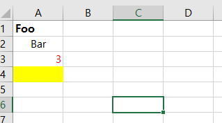

# XlsxWriter를 사용한 Excel 프로그래밍
## 폰트 크기 색상 굵기 배경색 바꾸기

1. workbook에 format 추가하기
- 폰트 크기, 색상, 굵기, 배경색 변경하기
```
cell_format = workbook.add_format({
    'bold': True,
    'font_size': 12,
})
cell_color_format = workbook.add_format({
    'color': 'red',
})
cell_center_format = workbook.add_format({
    'align': 'center',
    'valign': 'vcenter',
})
cell_bg_format = workbook.add_format({
    'bg_color': 'yellow',
})
worksheet.write       (0, 0, 'Foo', cell_format)
worksheet.write_string(1, 0, 'Bar', cell_center_format)
worksheet.write_number(2, 0, 3,     cell_color_format)
worksheet.write_blank (3, 0, '',    cell_bg_format)
```

