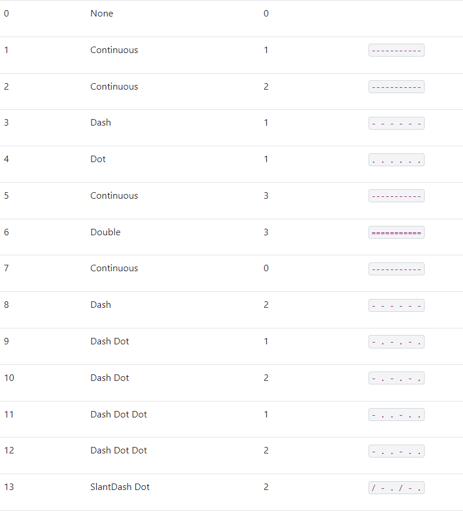
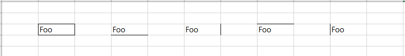
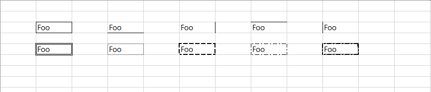

# XlsxWriter를 사용한 Excel 프로그래밍
## 셀의 테두리 변경하기




``` 
cell_border_format = workbook.add_format({
    'border': 1,
})
cell_bottom_format = workbook.add_format({
    'bottom': 1,
})
cell_right_format = workbook.add_format({
    'right': 1,
})
cell_top_format = workbook.add_format({
    'top': 1,
})
cell_left_format = workbook.add_format({
    'left': 1,
})
worksheet.write       (2, 1, 'Foo', cell_border_format)
worksheet.write       (2, 3, 'Foo', cell_bottom_format)
worksheet.write       (2, 5, 'Foo', cell_right_format)
worksheet.write       (2, 7, 'Foo', cell_top_format)
worksheet.write       (2, 9, 'Foo', cell_left_format)
```




```
cell_Double_format = workbook.add_format({
    'border': 6,
})
cell_Continuous_format = workbook.add_format({
    'border': 7,
})
cell_Dash_format = workbook.add_format({
    'border': 8,
})
cell_Dash_Dot_format = workbook.add_format({
    'border': 9,
})
cell_SlantDash_Dot_format = workbook.add_format({
    'border': 13,
})
worksheet.write       (4, 1, 'Foo', cell_Double_format)
worksheet.write       (4, 3, 'Foo', cell_Continuous_format)
worksheet.write       (4, 5, 'Foo', cell_Dash_format)
worksheet.write       (4, 7, 'Foo', cell_Dash_Dot_format)
worksheet.write       (4, 9, 'Foo', cell_SlantDash_Dot_format)
```

